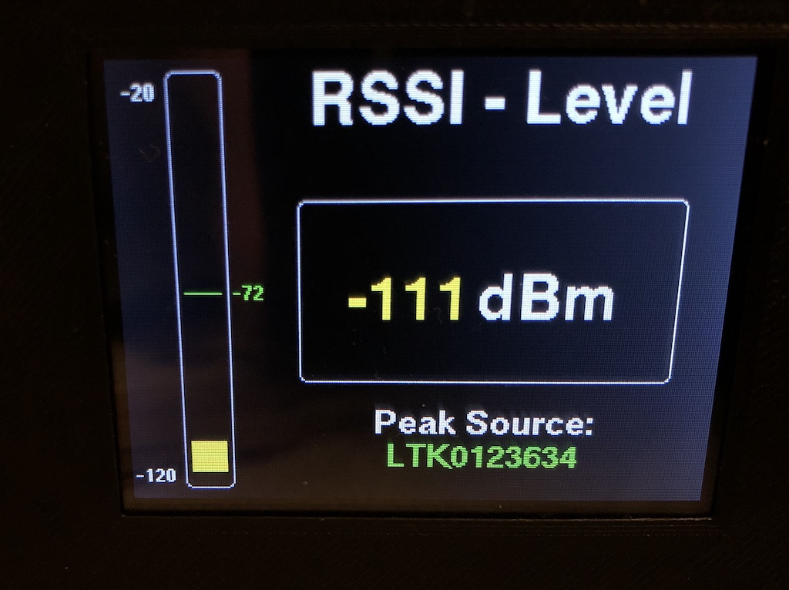
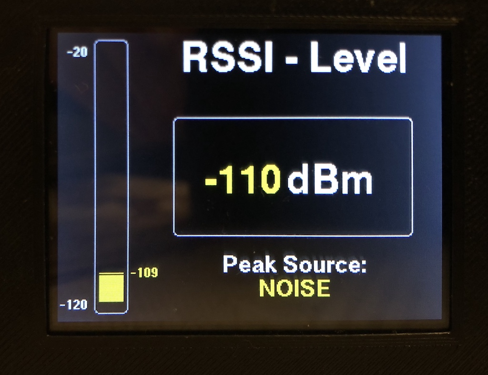
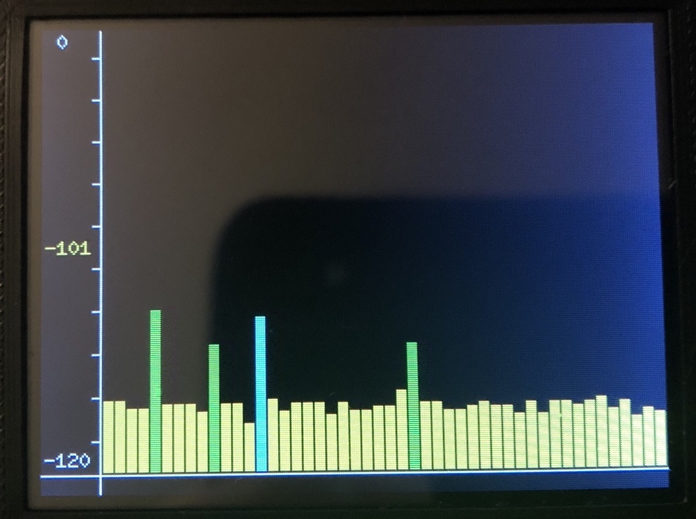

# AskSinAnalyzer

❗ **Achtung:** Vor einem Update unbedingt das [CHANGELOG](https://github.com/jp112sdl/AskSinAnalyzer/blob/master/CHANGELOG.md) lesen!

 

### Der Funktelegramm-Dekodierer für den Einsatz in HomeMatic Umgebungen! 
### Perfekt zur Fehlersuche, wenn der DC mal wieder ins Unermessliche steigt _(WER sendet denn hier dauernd an WEN?)_ oder Störern, wenn sich wieder mal ein Gerät in einer Reboot-Schleife befindet. 
### Nähere Informationen findet ihr im [Wiki](https://github.com/jp112sdl/AskSinAnalyzer/wiki)!
und im Diskussions-Thread des [HomeMatic Forums](https://homematic-forum.de/forum/viewtopic.php?f=76&t=51161)

**:point_right: Siehe auch [AskSinAnalyzerXS](https://github.com/psi-4ward/AskSinAnalyzerXS), der Analyzer als Desktop-App ohne ESP und Display.**

  
 
  
 
Prototyp
