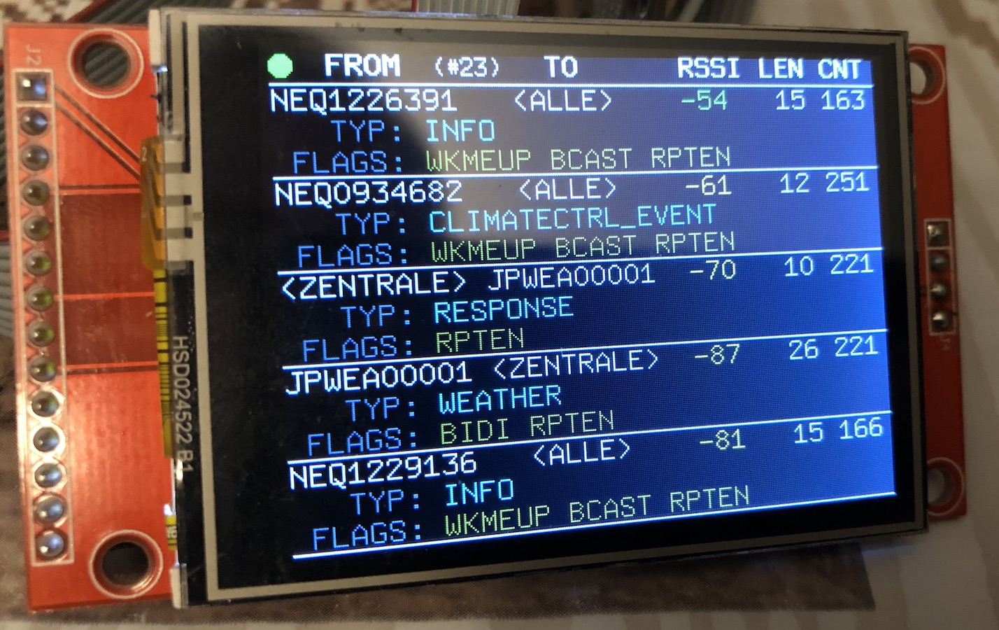
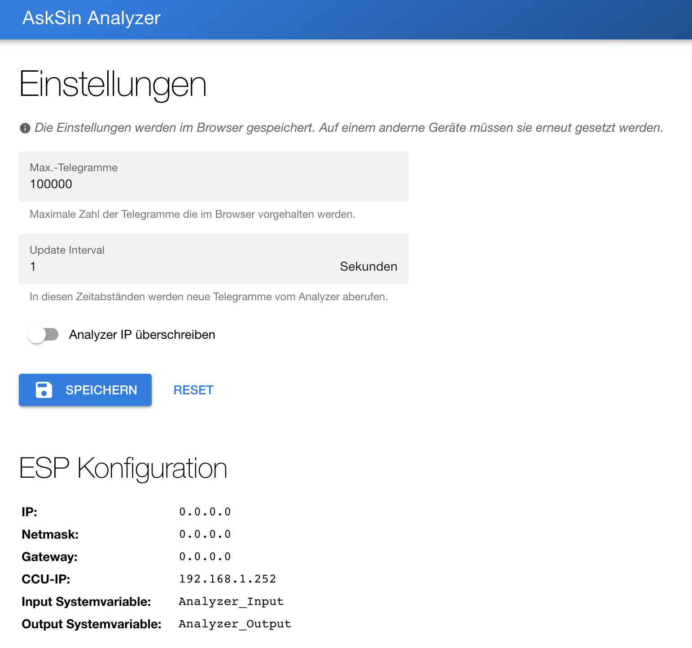
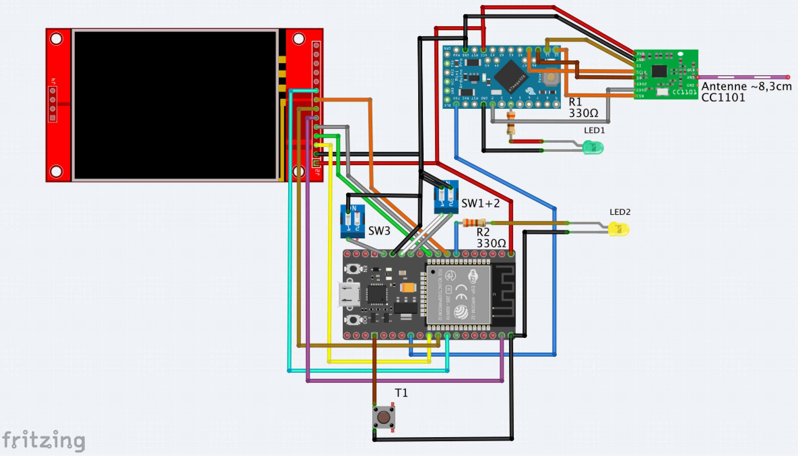
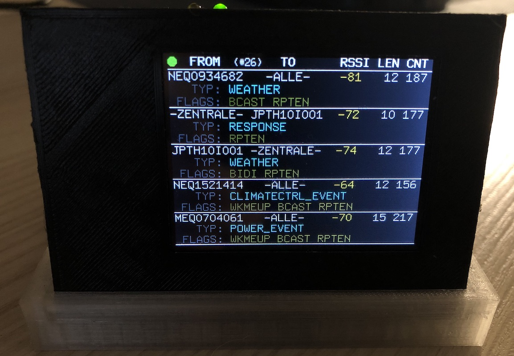
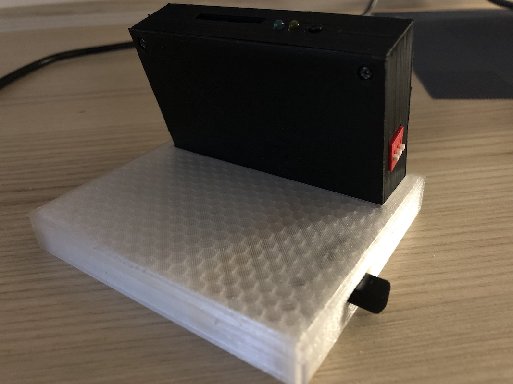
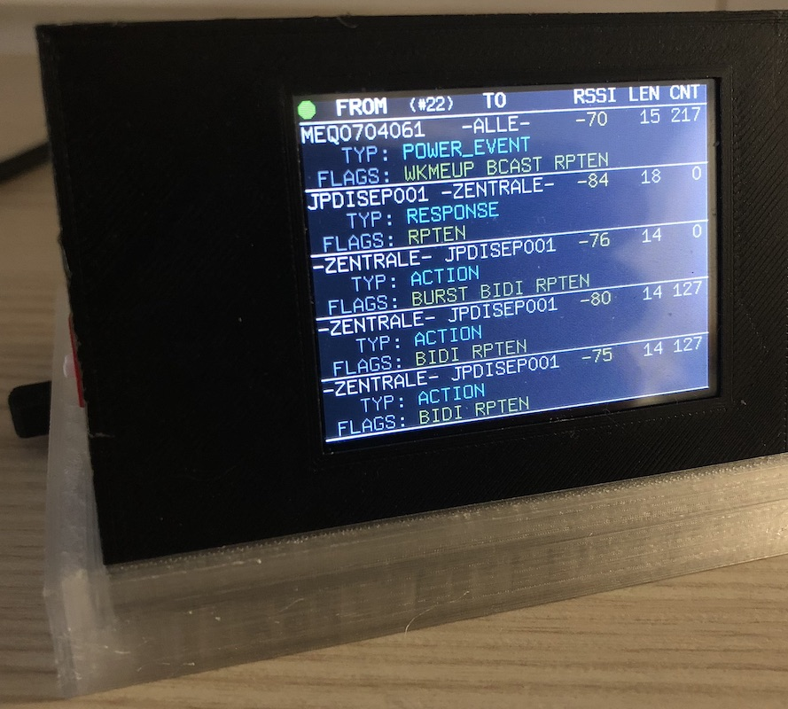

# AskSinAnalyzer
### Work In Progress...

### web log viewer
#### Vielen Dank an [Christoph](https://github.com/psi-4ward) für das Entwickeln der Weboberfläche

### Schaltplan

### Bauteile
- AskSinSniffer328P:
  - 1x Arduino Pro Mini 3.3V/8MHz
  - 1x CC1101 868MHz
  - 1x Widerstand 330Ohm
  - 1x LED
- AskSinAnalyzerESP32:
  - ESP32 Board
  - ILI9341 TFT Display (optional)
  - 3x DIP-Schalter (nur 1x DIP-Schalter wenn kein Display verwendet wird)
  - 1x Taster
  - 1x Widerstand 330 Ohm
  - 1x LED
  
### CCU Programm zur Auflösung Adresse->Seriennummer
  ...
  
### Konfiguration (AP-Modus) des ESP32
  ...
  

### Prototyp

 
 

