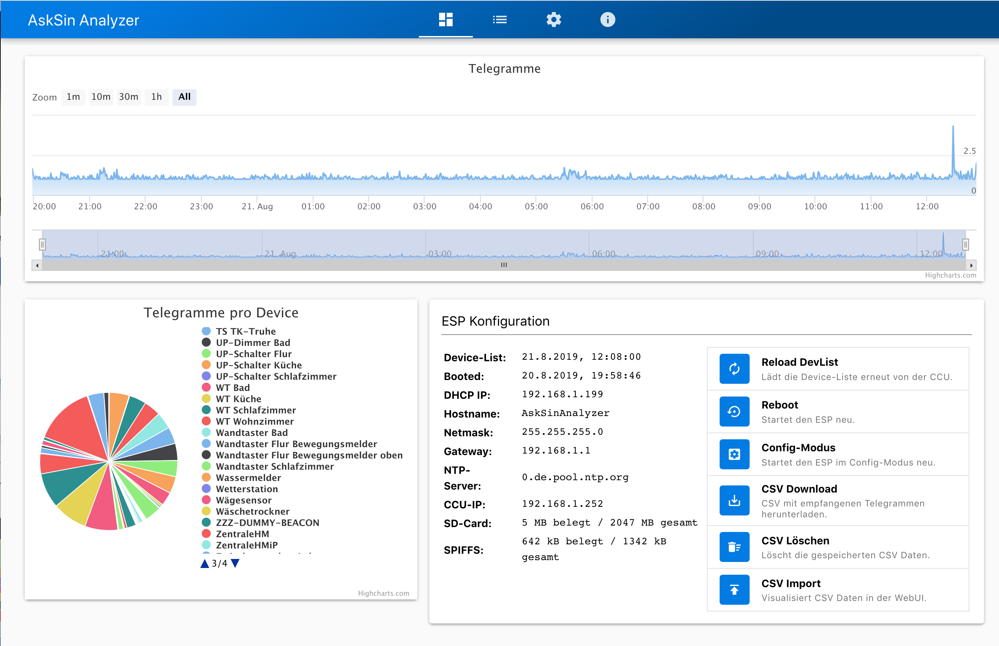

# AskSin Analyzer WebUI

Built with [Vue.js](http://vuejs.org) and [Qasar](https://quasar.dev).



## Project setup
```
npm install
```

### Compiles and hot-reloads for development
```
npm run dev
```

### Compiles and minifies for production
```
export VUE_APP_CDN_URL=https://user.github.io/AskSinAnalyzer
npm run build
```
